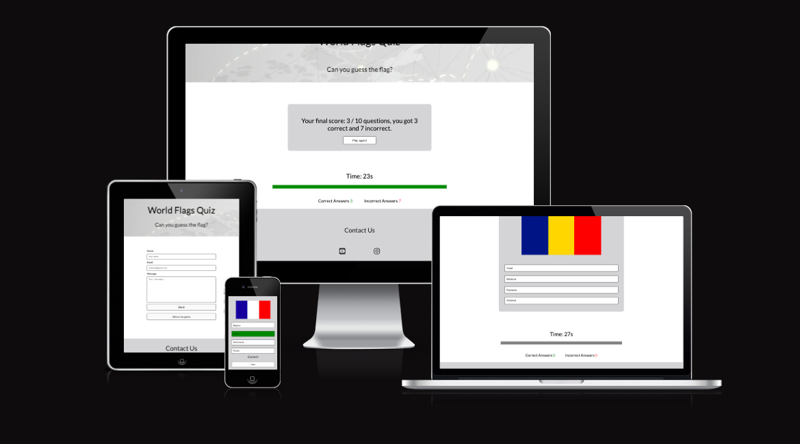
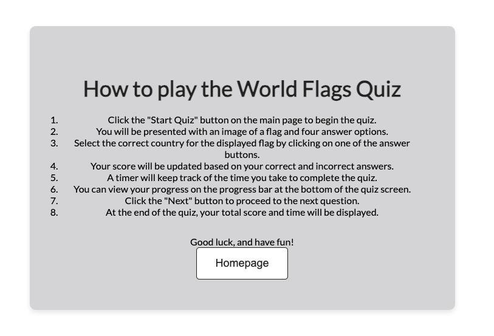
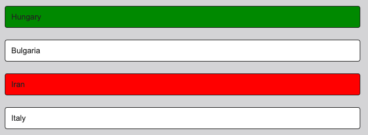
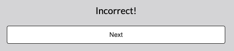
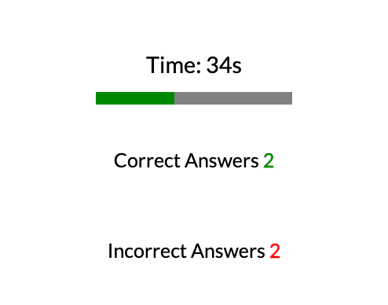
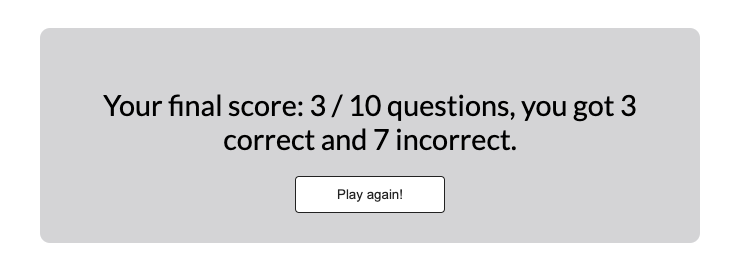

# World Flags Quiz
[View website here](https://amandakoka.github.io/milestone-two/)

## Table of Content

1. [Project Goals](#project-goals)
    1. [User Goals](#user-goals)
    2. [Site Owner Goals](#site-owner-goals)
2. [User Experience](#user-experience)
    1. [Target Audience](#target-audience)
    2. [User Requirements and Expectations](#user-requirements-and-expectations)
    3. [User Stories](#user-stories)
    4. [Site Owner Stories](#site-owner-stories)
    5. [Rationale For Development](#rationale-for-development)
3. [Design](#design)
    1. [Design Choices](#design-choices)
    2. [Images](#images)
    3. [Colour](#colours)
    4. [Fonts](#fonts)
    5. [Structure](#structure)
    6. [Wireframes](#wireframes)
4. [Features](#features)
5. [Technologies Used](#technologies-used)
    1. [Languages](#languages)
    2. [Frameworks & Tools](#frameworks--tools)
    3. [EmailJS](#emailjs)
6. [Testing](#testing)
7. [Bugs](#bugs) 
8. [Deployment](#deployment)
9. [Credits](#credits) 
    1. [Media](#media)
    2. [Code](#code)

# Project Goals 
The World Flags Quiz is a classic flag guessing game designed to test users' knowledge of flags and provide a fun educational experience.

## User Goals 
* Play a fun and engaging world flag guessing game. 
* Test your knowledge by guessing the flags' names. 

## Site Owner Goals 
* Create a fun and engaging game that users will want to play repeatedly.
* Ensure the quiz is interactive and fully responsive to be played on different devices.

# User Experience 
## Target Audience 
* Primary School Teachers: To use as an educational tool in geography lessons.
* Students: Particularly those aged 7-12, to make learning about world flags enjoyable.
* Parents: To help their children learn about world geography in a fun way.
* People looking for a fun, quick game to play.
* Anyone with an interest in flags and guessing games.

The World Flags Quiz is designed to cater to a diverse audience, making it an ideal educational tool for primary school teachers, students, parents, and geography enthusiasts. Primary school teachers can incorporate the quiz into their geography lessons, providing a fun and interactive way for students to learn about world flags. Students, particularly those aged 7-12, will find the game engaging and educational, helping them to improve their knowledge of world geography in an enjoyable manner. Parents can use the quiz as a supplemental learning activity at home, making education a fun family activity. Additionally, individuals with a keen interest in flags and quick, entertaining games will find the quiz challenging and enjoyable. The website's simple, intuitive navigation, responsive design, and interactive features ensure it meets the needs of all users, providing a seamless and engaging experience across different devices.

## User Requirements and Expectations 
* A simple, intuitive navigation system.
* Quick, easy, fun game to play.
* Links and buttons to work as expected.
* Accessibility 
* Easy way to leave feedback 

## User Stories 
1. As a user, I want to test my knowledge on world flags.
2. As a user, I want to know what the right flag is in case I don't pick correctly.
3. As a user, I want to see how many flags I have got correct and incorrect.
4. As a user, I want to see how long I take guessing the flags.
5. As a user, I want to receive feedback when I get an answer correct or incorrect.

## Site Owner Stories 
1. As a site owner, I want users to be able to contact us and leave any feedback.
2. As a site owner, I want users to find us on social media. 
3. As a site owner, I want all users to be able to play the quiz easily.

## Rationale for Development

### Purpose
The World Flags Quiz was conceived and developed with the primary purpose of providing an engaging and educational experience centered around world flags. The project aims to serve as an interactive tool that enhances users' knowledge of flags from different countries in a fun and accessible manner. By combining elements of gaming with educational content, the quiz seeks to make learning about world flags enjoyable for users of all ages, particularly targeting primary school teachers, students aged 7-12, parents, and flag enthusiasts.

### User Needs
The development of the World Flags Quiz addresses several key user needs:

1. **Educational Engagement**: There is a need for educational tools that can engage students in learning outside the traditional classroom setting. The quiz provides an interactive way for primary school teachers to supplement their geography lessons, making it easier for students to learn and remember country flags.

2. **Family Engagement**: Parents are often looking for educational activities that they can enjoy with their children at home. The World Flags Quiz offers a family-friendly environment where parents and their children can play together while learning about world flags.

3. **Entertainment and Learning**: Users, especially those interested in geography and flags, seek fun and educational games that challenge their knowledge. The quiz offers a gamified approach to learning about world flags, enhancing engagement through interactive gameplay and immediate feedback.

4. **Accessibility and Ease of Use**: The quiz is designed to be accessible and easy to use for users of all ages and technical abilities. It features a simple and intuitive user interface, ensuring that users can navigate the quiz, answer questions, and receive feedback without difficulty.

### Target Audience
The World Flags Quiz is designed to cater to a diverse audience, including:

- **Primary School Teachers**: To use as an educational tool in geography lessons, promoting interactive learning through quizzes.
  
- **Students (Aged 7-12)**: To make learning about world flags enjoyable and engaging, encouraging self-paced exploration and knowledge retention.
  
- **Parents**: To help their children learn about world geography in a fun and interactive way, fostering family engagement in educational activities.
  
- **Flag Enthusiasts**: Anyone with an interest in flags and geography, looking for a challenging and entertaining quiz experience.
  
- **General Public**: People looking for a quick and fun game to play, testing their knowledge of world flags in a relaxed setting.

### User Stories
The development of the World Flags Quiz is guided by specific user stories, ensuring that the project meets the needs and expectations of its target audience:

1. **As a user, I want to test my knowledge on world flags.**
   - The quiz provides a platform for users to challenge themselves and learn about flags from different countries.

2. **As a user, I want to know what the right flag is in case I don't pick correctly.**
   - Immediate feedback is provided to users, indicating whether their answer is correct or incorrect.

3. **As a user, I want to see how many flags I have got correct and incorrect.**
   - Users can track their progress and see their score based on the number of flags they have guessed correctly.

4. **As a user, I want to see how long I take guessing the flags.**
   - The quiz includes a timer feature, allowing users to see how quickly they can identify each flag.

5. **As a user, I want to receive feedback when I get an answer correct or incorrect.**
   - Feedback is provided instantly to users, enhancing the learning experience and encouraging further engagement.

### Conclusion
In conclusion, the development of the World Flags Quiz aims to provide an engaging and educational experience for users interested in world flags. By addressing the needs of primary school teachers, students, parents, and flag enthusiasts, the project aims to promote interactive learning and family engagement through an accessible and entertaining quiz format. The quiz's user-centric design, including intuitive navigation, immediate feedback, and responsive functionality, ensures a seamless and enjoyable experience for users across different devices and skill levels.

The project's well-defined purpose, clear user stories, and consideration of user needs and expectations contribute to its overall success as an educational tool and a fun, challenging game. Through continuous improvement and user feedback, the World Flags Quiz will evolve to better serve its audience and maintain its position as a valuable resource for learning about world flags in an engaging and interactive way.

# Design 
## Design Choices 
The World Flags quiz prioritizes a simple and clean layout to ensure users can immerse themselves in the quiz without unnecessary distractions. The primary goal is to create an engaging environment where users can focus on the challenge of identifying flags. By using a straightforward design, users can navigate effortlessly and concentrate on the quiz content. This design promotes accessibility and inclusivity, allowing a diverse audience to enjoy the game without complications.
## Colour 
The color palette for the website was carefully chosen to coordinate with the grey header image. To maintain visual coherence, a color picker tool was employed to extract a suitable grey shade from the header image. This approach makes sure that the colors blend smoothly across the entire website.The deliberate use of a simple color scheme aims to facilitate a smooth user experience, minimizing potential distractions and enabling users to concentrate on the vibrant colors of the flags displayed in the quiz.
- [Header Image](documentation/background.png)
- [Colour picker image](documentation/colourpicker.png)
## Images 
All flag images used in the World Flags Quiz are from freepik.com by rawpixel.com. Proper credit has been attributed to rawpixel.com in the "Credits" section. These images not only contribute to the visual appeal of the quiz but also align with its educational and engaging nature. They enhance the overall aesthetic, allowing users to explore and identify flags from around the world, thereby enriching the quiz experience.
## Fonts
Choosing the right font is important to maintaining the overall simplicity and cleanliness of the design. I opted for the Lato font from Google Fonts for its clean and modern aesthetic. This font enhances the readability of the quiz content, ensuring that users can easily comprehend text instructions, flag names, and any additional information provided during the quiz.
## Structure 
The website is structured in a user-friendly and easy-to-use way and designed with a simple and clean layout to ensure an immersive, distraction-free experience. The website consists of 3 pages:

1. **Homepage(The Quiz)**:
- Upon entering the website, users are greeted with a welcome message and an "Instructions" and "Start Quiz" button.
- Clicking the "Start Quiz" button leads users to the actual quiz, where there's a series of flag images to identify.
- The layout prioritizes ease of navigation, allowing users to focus on the challenge of guessing flags.
- There are 10 questions for users to have a go at with 4 buttons to choose from.
- Once the user choses and answer they find out if they got it correct and a next button appears to go onto the next question.
- When the user finishes the quiz a score page appears with their score and a play again button appears so users can play again. The flags chaneg order each time the quiz is played.
2. **Instructions page**:
- Once the instructions button had been pressed, users are redirected to a intrusctions page where there is list of instructions on how to play the quiz.
- When the user has read the instructions and know how to play, they can press the button that takes them back to the home page so they start the quiz.
3. **Contact us page(where users can contact with any concerns/questions)**:
- A separate "Contact Us" page is available for users to reach out with concerns or questions located in the footer.
- The contact form enables easy communication and provides users with a platform to leave feedback.
- The user has to fill out all sections to send an email successfully. The send button changes text and "message sent successfully" appears when the email has been sent.
- There is also a "return to game" button so users can go back to the quiz.

[Structure Flowchart](documentation/flowchart.png)

## Wireframes 
* [Home page](documentation/wireframes/wireframe.png)
* [Instructions page](documentation/wireframes/instructionswireframe.png)
* [Contact us page](documentation/wireframes/contactwireframe.png)

# Features 
### Start Screen
- Welcomes the user and has the "start quiz" button to start the quiz and "instructions" button that redirects to intstructions page.

Screenshots

 

### Instructions Page
- Explains to the user how the quiz is played and has a "back" button that redirects to start screen so once the user is familiar they can play.

Screenshots

 

### Quiz Buttons (Interactive Color Change)
- Quiz buttons undergo a dynamic color change on user interaction, providing instant visual feedback. The hover effect transforms the background and text color of the buttons.

Screenshots

 

### Message Container(Instant Feedback)
- The message container offers immediate feedback to users based on their quiz performance. Clearly communicates whether the user got the answer correct or incorrect.

Screenshots

 

### Timer
- Users are timed on how long they take to complete the quiz, allowing them to experience and engaging game.

Screenshots

 

### Progress Bar
- The progress bar visually represents the user's progress through the quiz. Changes in the bar provide users with a clear visual indicator of their progress within the quiz.

Screenshots

 

### Incorrect and Correct Scores
- Scores for correct and incorrect answers are dynamically updated in real-time during the quiz. The background colors (red for incorrect, green for correct), enhance the user experience and aid comprehension.

Screenshots

 

### Final Score 
- At the end of the quiz users receive a comprehensive final score, including the breakdown of correct and incorrect answers.

Screenshots

 

### Contact Form:
- A contact us link is provided in the footer. When clicked a contact form is available on the "Contact Us" page, enabling users to reach out to the site owner with any concerns or feedback.

Screenshots

 

### Social Media Links:
Social media icons in the footer provide users with direct links to the site owner's social media profiles.

Screenshots

 

### Responsive Design:
The quiz is designed to be fully responsive, ensuring an optimal experience across various devices and screen sizes.

# Technologies Used
## Languages  
- HTML: Used for structuring the content and creating the foundation of the web pages.
- CSS: Applied for styling and layout, ensuring a visually cohesive and responsive design.
- JavaScript: Implemented for interactive features and enhancing the user experience.
## Frameworks & Tools
- [Figma](https://www.figma.com/): Utilized for creating wireframes, providing a visual representation of the website's layout and design.
- [Google Fonts](https://fonts.google.com/): Integrated to enhance the typography, offering a diverse range of fonts to elevate the visual aesthetics of the content.
- [Font Awesome](https://fontawesome.com/): Incorporated for the inclusion of icons in the footer, contributing to a more visually appealing and informative user interface.
- [GitHub](https://github.com/): Employed as a version control system and a collaborative platform for storing and managing the project's source code
- [Git](https://git-scm.com/): Utilized for version control, allowing seamless collaboration, tracking changes, and ensuring a well-documented development process. Commits and pushes to GitHub provide a clear history of project evolution.
- [EmailJS](https://www.emailjs.com/): Integrated for handling form submissions and facilitating email communication from the website.
- [Pixelied](https://pixelied.com/convert/png-converter/png-to-webp): Convert png image to webp.
- [TinyPNG](https://tinypng.com/): Compress webp image.
## EmailJS
I used EmailJS which allows users to send emails. 
To do this:
1. Sign Up for EmailJS:
- Visit the EmailJS website and sign up for an account.
2. Create a New Email Service:
- After signing up, log in to your EmailJS account.
- Create a new email service, and note the Service ID.
3. Create an Email Template:
- Create an email template within the service, specifying the template content and structure.
- Note the Template ID.
4. Get Your Public Key:
- Retrieve your EmailJS public key from your account settings.
5. Include EmailJS Library in Your Project:
- Add the EmailJS library to your HTML file by including the following script tag in the head section

# Testing
Testing for this website can be found in the [TESTING.md](TESTING.md)

# Deployment

The World Flags Quiz project is deployed on GitHub Pages, providing a convenient way to showcase and access the quiz online. The following steps outline the deployment process:

1. **GitHub Repository:**
   - The project is stored in a GitHub repository, ensuring version control and collaboration.

2. **GitHub Pages:**
   - GitHub Pages is utilized for hosting the live version of the World Flags Quiz.
   - Navigate to the "Settings" tab in the GitHub repository.

3. **Source Branch:**
   - In the "Settings" tab, scroll down to the "GitHub Pages" section.
   - Choose `main` from the branch menu. Select `root` from the folder menu and save. GitHub Pages will deploy the site.

4. **Deployment:**
   - After selecting the source branch, GitHub Pages will provide the URL where the live site is accessible.

5. **Live Site URL:**
   - The live version of the World Flags Quiz can be accessed at your GitHub Pages URL.

## Local Deployment

You can fork and clone the World Flags Quiz repository to deploy it locally:

**Forking the Repository:**

1. Log in or sign up to GitHub.
2. Find the repository for the World Flags Quiz.
3. Click the "Fork" button in the top right corner.

**Cloning the Repository:**

1. Log in or sign up to GitHub.
2. Find the repository for the World Flags Quiz.
3. Click on the "Code" button and select whether you would like to clone with HTTPS, SSH, or GitHub CLI and copy the link shown.
4. Open the terminal in your code editor and change the current working directory to the location you want to use for the cloned directory.
5. Type `git clone`, then paste the link you copied in step 3 and press Enter.

## Issues During Deployment

During deployment, some common issues might arise:

- **Configuration Errors:** Incorrect settings in GitHub Pages settings, such as choosing the wrong branch or folder for deployment.
  - **Solution:** Double-check your GitHub Pages settings in the repository "Settings" tab. Ensure you have selected the correct branch and root folder for deployment.

- **Build Failures:** If your project requires a build step (like compiling code, installing dependencies, etc.), errors during these processes can prevent successful deployment.
  - **Solution:** 
    1. Verify that your build script (`package.json`, etc.) is correctly configured.
    2. Check the build logs or console output for error messages to diagnose the issue.
    3. Ensure all necessary dependencies are installed (`npm install`, etc.).

- **Permissions:** If there are permission issues (e.g., trying to access a private repository without proper credentials), deployment can fail.
  - **Solution:** 
    1. Make sure you have the correct permissions to access the repository.
    2. If deploying to a private repository, ensure your SSH keys or access tokens are set up correctly.
    3. Check repository settings to ensure you have the necessary access.

- **Cache Issues:** Sometimes old cached files can cause issues with the deployed site. Clearing the cache or doing a hard reload can resolve this.
  - **Solution:** 
    1. Clear your browser cache or use a private browsing window to test the site.
    2. If deploying to GitHub Pages, you can force a cache refresh by appending a query string to your URLs (e.g., `?v=2`).

## Justification for GitHub Pages Deployment

I have chosen to deploy the World Flags Quiz project on GitHub Pages for several reasons:

- **Free Hosting:** GitHub Pages is free to use, which is beneficial for open-source projects or personal websites.
- **Integration with GitHub:** As the project is already hosted on GitHub, deploying it to GitHub Pages is straightforward and integrates well with existing workflows.
- **Automatic Deployment:** GitHub Pages automatically builds and deploys your site when you push to the selected branch, making it convenient.
- **Custom Domain Support:** GitHub Pages supports custom domains, allowing you to use your own domain name if needed.

This method of deployment is both convenient and efficient, providing a live version of the project with minimal setup and maintenance.

# Credits 

## Media 
All images of flags were sourced from the Freepik website and created by [rawpixel.com](https://www.freepik.com/search?author=2199844&authorSlug=rawpixel.com&format=author&query=flags).

- [Illustration: Portugal Flag](https://www.freepik.com/free-vector/illustration-portugal-flag_2807795.htm#query=flag&position=23&from_view=author&uuid=f3077a91-7aba-4618-a5cf-4b75c1b86f08) by rawpixel.com on Freepik
- [Illustration: France Flag](https://www.freepik.com/free-vector/illustration-france-flag_2922485.htm#query=flags&position=1&from_view=author&uuid=35b95d32-8225-4062-8c5f-f2225695b948) by rawpixel.com on Freepik
- [Illustration: Denmark Flag](https://www.freepik.com/free-vector/illustration-denmark-flag_2922490.htm#query=flags&position=4&from_view=author&uuid=35b95d32-8225-4062-8c5f-f2225695b948) by rawpixel.com on Freepik
- [Illustration: Sweden Flag](https://www.freepik.com/free-vector/illustration-sweden-flag_2922488.htm#query=flags&position=11&from_view=author&uuid=35b95d32-8225-4062-8c5f-f2225695b948) by rawpixel.com on Freepik
- [Illustration: Romania Flag](https://www.freepik.com/free-vector/illustration-romania-flag_2922499.htm#query=flags&position=13&from_view=author&uuid=f27babde-8a24-4394-8f60-a99fcdf280d7) by rawpixel.com on Freepik
- [Illustration: Switzerland Flag](https://www.freepik.com/free-vector/illustration-switzerland-flag_2922486.htm#query=flags&position=18&from_view=author&uuid=f27babde-8a24-4394-8f60-a99fcdf280d7) by rawpixel.com on Freepik
- [Illustration: Croatia Flag](https://www.freepik.com/free-vector/illustration-croatia-flag_2922525.htm#query=flags&position=20&from_view=author&uuid=f27babde-8a24-4394-8f60-a99fcdf280d7) by rawpixel.com on Freepik
- [Illustration: Czech Republic Flag](https://www.freepik.com/free-vector/illustration-czech-republic-flag_2922495.htm#query=flags&position=23&from_view=author&uuid=f27babde-8a24-4394-8f60-a99fcdf280d7) by rawpixel.com on Freepik
- [Illustration: Italy Flag](https://www.freepik.com/free-vector/illustration-italy-flag_2922484.htm#query=flags&position=28&from_view=author&uuid=f27babde-8a24-4394-8f60-a99fcdf280d7) by rawpixel.com on Freepik
- [Illustration: Portugal Flag](https://www.freepik.com/free-vector/illustration-portugal-flag_2807795.htm#query=flags&position=25&from_view=author&uuid=b39fe788-b7a3-4df1-8df5-5d4ac6f2ce13) by rawpixel.com on Freepik

## Code 
- The score area HTML, CSS, and JS code were written with the help of Code Institute's Love Maths project.
- The footer HTML and CSS code were reused and modified from my [previous project](https://github.com/amandakoka/autismawareness).
- The contact form HTML and CSS were reused and modified from my [previous project](https://github.com/amandakoka/autismawareness).
- The contact form's JS code was written with the help of the [EmailJs tutorials](https://www.emailjs.com/docs/tutorial/creating-contact-form/) and a [YouTube tutorial](https://youtu.be/qxWDVRyc95E?si=rJUAMLa7AzZuczgo).
- The code to shuffle the array of questions was written with the help of [GeeksForGeeks](https://www.geeksforgeeks.org/how-to-shuffle-an-array-using-javascript/amp/)
