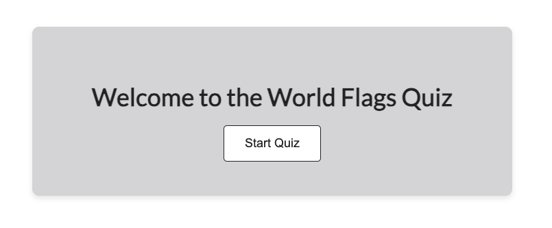
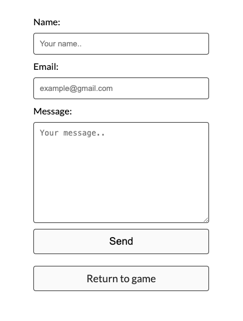

# World Flags Quiz
[View website here](https://amandakoka.github.io/milestone-two/)

## Table of Content

1. [Project Goals](#project-goals)
    1. [User Goals](#user-goals)
    2. [Site Owner Goals](#site-owner-goals)
2. [User Experience](#user-experience)
    1. [Target Audience](#target-audience)
    2. [User Requirements and Expectations](#user-requirements-and-expectations)
    3. [User Stories](#user-stories)
    4. [Site Owner Stories](#site-owner-stories)
3. [Design](#design)
    1. [Design Choices](#design-choices)
    2. [Images](#images)
    3. [Colour](#colours)
    4. [Fonts](#fonts)
    5. [Structure](#structure)
    6. [Wireframes](#wireframes)
4. [Features](#features)
5. [Technologies Used](#technologies-used)
    1. [Languages](#languages)
    2. [Frameworks & Tools](#frameworks--tools)
    3. [EmailJS](#emailjs)
6. [Testing](#testing)
    1. [HTML Validation](#html-validation) 
    2. [CSS Validation](#css-validation) 
    3. [JavaScript Validation](#javascript-validation) 
    4. [Performance](#performance)  
    5. [Device testing](#device-testing) 
    6. [Browser testing](#browser-testing) 
    7. [Bugs while testing devices, broswers](#bugs-while-testing-browser-and-devices)
    8. [Testing user stories](#testing-user-stories) 
7. [Bugs](#bugs) 
8. [Deployment](#deployment)
9. [Credits](#credits) 
    1. [Media](#media)
    2. [Code](#code)

# Project Goals 
The world flags quiz is a a classic flag guessing game to test users knowledge on flags and a fun educational game to play!
## User Goals 
* Play a fun and engaging world flag guessing game. 
* Test your knowledge by guessing the flags name. 
## Site Owner Goals 
* Create a fun and engaging game that users will want to play over and over again.
* The quiz should be interactive and fully responsive to be able to be played on different devices.

# User Experience 
## Target Audience 
* Students who need to test their knowledge.
* People looking for a fun, quick game to play.
* Anyone with an interest with flags and guessing games.
## User Requirements and Expectations 
* A simple, intuitive navigation system.
* Quick, easy, fun game to play.
* Links and buttons to work as expected.
* Accessibility 
* Easy way to leave feedback 
## User Stories 
1. As a user, I want to test my knowledge on world flags.
2. As a user, I want to know what the right flag is in case I don't pick correctly.
3. As a user, I want to see how many flags I have got correct and incorrect.
4. As a user, I want to see how long I take guessing the flags.
5. As a user, I want to receive feedback when I get an answer correct or incorrect.
## Site Owner Stories 
1. As a site owner, I want users to be able to contact us and leave any feedback.
2. As a site owner, I want users to find us on social media. 
3. As a site owner, I want all users to be able to play the quiz easily.

# Design 
## Design Choices 
The World Flags quiz prioritizes a simple and clean layout to ensure users can immerse themselves in the quiz without unnecessary distractions. The primary goal is to create an engaging environment where users can focus on the challenge of identifying flags. By using a straightforward design, users can navigate effortlessly and concentrate on the quiz content. This design promotes accessibility and inclusivity, allowing a diverse audience to enjoy the game without complications.
## Colour 
The color palette for the website was carefully chosen to coordinate with the grey header image. To maintain visual coherence, a color picker tool was employed to extract a suitable grey shade from the header image. This approach makes sure that the colors blend smoothly across the entire website.The deliberate use of a simple color scheme aims to facilitate a smooth user experience, minimizing potential distractions and enabling users to concentrate on the vibrant colors of the flags displayed in the quiz.
- [Header Image](documentation/background.png)
- [Colour picker image](documentation/colourpicker.png)
## Images 
All flag images used in the World Flags Quiz are from freepik.com by rawpixel.com. Proper credit has been attributed to rawpixel.com in the "Credits" section. These images not only contribute to the visual appeal of the quiz but also align with its educational and engaging nature. They enhance the overall aesthetic, allowing users to explore and identify flags from around the world, thereby enriching the quiz experience.
## Fonts
Choosing the right font is important to maintaining the overall simplicity and cleanliness of the design. I opted for the Lato font from Google Fonts for its clean and modern aesthetic. This font enhances the readability of the quiz content, ensuring that users can easily comprehend text instructions, flag names, and any additional information provided during the quiz.
## Structure 
The website is structured in a user-friendly and easy-to-use way and designed with a simple and clean layout to ensure an immersive, distraction-free experience. The website consists of 2 pages:

1. Homepage(The Quiz):
- Upon entering the website, users are greeted with a welcome message and a "Start Quiz" button.
- Clicking the "Start Quiz" button leads users to the actual quiz, where there's a series of flag images to identify.
- The layout prioritizes ease of navigation, allowing users to focus on the challenge of guessing flags.
- There are 10 questions for users to have a go at with 4 buttons to choose from.
- Once the user choses and answer they find out if they got it correct and a next button appears to go onto the next question.
- When the user finishes the quiz a score page appears with their score and a play again button appears so users can play again. The flags chaneg order each time the quiz is played.
2. Contact us page(where users can contact with any concerns/questions)
- A separate "Contact Us" page is available for users to reach out with concerns or questions located in the footer.
- The contact form enables easy communication and provides users with a platform to leave feedback.
- The user has to fill out all sections to send an email successfully. The send button changes text and "message sent successfully" appears when the email has been sent.
- There is also a "return to game" button so users can go back to the quiz.

## Wireframes 
* [Home page](documentation/wireframes/wireframe.png)
* [Contact us page](documentation/wireframes/contactwireframe.png)

# Features 
### Start Screen
- Welcomes the user and has the "start quiz" button to start the quiz.

Screenshots

 

### Quiz Buttons (Interactive Color Change)
- Quiz buttons undergo a dynamic color change on user interaction, providing instant visual feedback. The hover effect transforms the background and text color of the buttons.

Screenshots

 

### Message Container(Instant Feedback)
- The message container offers immediate feedback to users based on their quiz performance. Clearly communicates whether the user got the answer correct or incorrect.

Screenshots

 

### Timer
- Users are timed on how long they take to complete the quiz, allowing them to experience and engaging game.

Screenshots

 

### Progress Bar
- The progress bar visually represents the user's progress through the quiz. Changes in the bar provide users with a clear visual indicator of their progress within the quiz.

Screenshots

 

### Incorrect and Correct Scores
- Scores for correct and incorrect answers are dynamically updated in real-time during the quiz. The background colors (red for incorrect, green for correct), enhance the user experience and aid comprehension.

Screenshots

 

### Final Score 
- At the end of the quiz users receive a comprehensive final score, including the breakdown of correct and incorrect answers.

Screenshots

 

### Contact Form:
- A contact us link is provided in the footer. When clicked a contact form is available on the "Contact Us" page, enabling users to reach out to the site owner with any concerns or feedback.

Screenshots

 

### Social Media Links:
Social media icons in the footer provide users with direct links to the site owner's social media profiles.

Screenshots

 

### Responsive Design:
The quiz is designed to be fully responsive, ensuring an optimal experience across various devices and screen sizes.

# Technologies Used
## Languages  
- HTML: Used for structuring the content and creating the foundation of the web pages.
- CSS: Applied for styling and layout, ensuring a visually cohesive and responsive design.
- JavaScript: Implemented for interactive features and enhancing the user experience.
## Frameworks & Tools
- [Figma](https://www.figma.com/): Utilized for creating wireframes, providing a visual representation of the website's layout and design.
- [Google Fonts](https://fonts.google.com/): Integrated to enhance the typography, offering a diverse range of fonts to elevate the visual aesthetics of the content.
- [Font Awesome](https://fontawesome.com/): Incorporated for the inclusion of icons in the footer, contributing to a more visually appealing and informative user interface.
- [GitHub](https://github.com/): Employed as a version control system and a collaborative platform for storing and managing the project's source code
- [Git](https://git-scm.com/): Utilized for version control, allowing seamless collaboration, tracking changes, and ensuring a well-documented development process. Commits and pushes to GitHub provide a clear history of project evolution.
- [EmailJS](https://www.emailjs.com/): Integrated for handling form submissions and facilitating email communication from the website.
- [Pixelied](https://pixelied.com/convert/png-converter/png-to-webp): Convert png image to webp.
- [TinyPNG](https://tinypng.com/): Compress webp image.
## EmailJS
I used EmailJS which allows users to send emails. 
To do this:
1. Sign Up for EmailJS:
- Visit the EmailJS website and sign up for an account.
2. Create a New Email Service:
- After signing up, log in to your EmailJS account.
- Create a new email service, and note the Service ID.
3. Create an Email Template:
- Create an email template within the service, specifying the template content and structure.
- Note the Template ID.
4. Get Your Public Key:
- Retrieve your EmailJS public key from your account settings.
5. Include EmailJS Library in Your Project:
- Add the EmailJS library to your HTML file by including the following script tag in the head section

# Testing
### HTML Validation 
The W3C validator was used to validate the HTML on all pages.

#### First Validation Test:
- **Home Page:**
  - Initial Validation: [Before Fix](documentation/html-validation/initial-html.png)
  - Issue: Missing image source and alt text.
  - Fix: Added a source to the image and included alt text.

- **Contact Page:**
  - Initial Validation: [Before Fix](documentation/html-validation/contact-html-val.png)
    - Issue 1: Unnecessary style attribute in the emailjs tag.
    - Issue 2: The 'a' element cannot be a descendant of a 'button' element.
  - Fix: Removed the style attribute and changed the button to a div element.

#### Final Validation Test:
- **Home Page:**
  - [After Fix](documentation/html-validation/html.png)

- **Contact Page:**
  - [After Fix](documentation/html-validation/contact-val-html2.png)

### CSS Validation

The W3C Jigsaw CSS validator was used to validate the CSS of the website. Both tests passed with no errors.

- [Full Page](documentation/css-validation/cssvalwebsite.png) 
- [Style.css File](documentation/css-validation/cssvalfile.png)

### JavaScript Validation

Google Chrome developer tools were used throughout to test JavaScript.

#### Console Output:
1. Insert "console.log" statements at different points in my JavaScript code when something wasn't working or I was testing to see if there were any errors.
2. Opened my website in my browser and accessed developer tools by selecting inspect.
   - Checked the "console" tab for any logs or error messages outputted by my JavaScript code.
3. All console logs were shown, and no error messages were found.

#### Manual Testing:

#### 1. Start the Quiz:
   - **Action:** Clicked the "Start Quiz" button.
   - **Expected Results:**
     - The quiz screen should be displayed.
     - The timer should start counting up.
   - **Verifications:**
     - Confirmed the display of the quiz screen.
     - Checked the accurate initiation of the timer.

#### 2. Answer Questions:
   - **Actions:**
     - Clicked on each answer for a question.
   - **Expected Results:**
     - The selected answer should be visually highlighted.
     - A correct/incorrect message should be displayed.
     - The correct and incorrect scores should be updated accordingly.
   - **Verifications:**
     - Checked the correct highlighting of the selected answer.
     - Verified the display of correct/incorrect messages.
     - Confirmed the accurate update of the correct and incorrect scores.

#### 3. Navigation:
   - **Actions:**
     - Clicked the "Next" button after answering each question.
   - **Expected Results:**
     - The next question should be displayed.
     - The progress bar should be accurately updated.
   - **Verifications:**
     - Ensured the display of the next question.
     - Validated the accurate update of the progress bar.

#### 4. Timer Functionality:
   - **Observations:**
     - Monitored the timer while answering questions.
   - **Expected Results:**
     - The timer should increment correctly.
     - The timer should stop when the quiz is completed.
   - **Verifications:**
     - Ensured correct and continuous timer incrementation.
     - Confirmed the timer stops when the quiz is completed.

#### 5. Restart Quiz:
   - **Action:** Clicked the "Play again!" button after completing the quiz.
   - **Expected Results:**
     - The quiz should reset.
     - The first question should be displayed and must be a different order.
     - Scores (correct and incorrect) should be reset.
   - **Verifications:**
     - Verified the successful reset of the quiz.
     - Confirmed the display of the first question and different order.
     - Checked and confirmed the reset of scores.

#### 6. Quiz Completion:
   - **Actions:**
     - Answered all questions and completed the quiz.
   - **Expected Results:**
     - The final score should be displayed.
     - The "Play again!" button should appear.
   - **Verifications:**
     - Validated the display of the final score.
     - Checked and confirmed the appearance of the "Play again!" button.

### Performance 
For the performance of the website, Lighthouse and Chrome Developer Tools were used to test the peformance of the website.
#### First Performance Test:
- **Home Page:**
  - Initial Performance: [Before Fix](documentation/performance/initial-hp-lighthouse.png)
  - Issue: Header image element too large.
  - Issue 2: Google Fonts link in html.
  - Fix: Converted my header png into a webp and compressed the image. Imported the google fonts url in my CSS.

- **Contact Page:**
  - Initial Performance: [Before Fix](documentation/performance/initial-cp-lighthouse.png)
    - Issue 1: Header image element too large.
    - Issue 2: Google Fonts link in html.
  - Fix: Converted my header png into a webp and compressed the image. Imported the google fonts url in my CSS.

#### Final Performance Test:
- **Home Page:**
  - [After Fix](documentation/html-validation/html.png)

- **Contact Page:**
  - [After Fix](documentation/html-validation/contact-val-html2.png)

### Device testing
The website was tested on the following devices: 

- MacBook air 13 inch
- Ipad 7th Gen
- Iphone 12
- Iphone 12 mini 

In addition, the website was tested using google chrome developer tools to ensure the responsiveness on different screen sizes by pressing all device options.

### Browser testing
The website was tested on the following browsers:

- Google Chrome
- Safari
- Firefox

### Bugs while testing browser and devices
| **Bug** | **Fix** |
| ----------- | ----------- |
|[Button Text Bug](documentation/bugs/button-text-bug.png) 
In mobile and tablet view the text in the quiz buttons and the next button were blue in all browsers I tested | Added a css style to the text in the buttons so they were black. |

### Testing user stories
1. As a user, I want to know what the right flag is in case I dont pick correctly.

| **Feature** | **Action** | **Expected Result** | **Actual Result** |
|-------------|------------|---------------------|-------------------|
| Quiz buttons | Attempt to answer a question | Display the correct flag name if the answer is incorrect | Works as expected. The correct flag lights up in green even if you pick the incorrect answer |

Screenshots

 

2. As a user, I want to see how many flags I have got correct and incorrect.

| **Feature** | **Action** | **Expected Result** | **Actual Result** |
|-------------|------------|---------------------|-------------------|
| Incorrect and correct scores | Answer quiz questions | Display real-time updates of correct and incorrect scores | Works as expected. Incorrect scores and correct scores are shown going through the quiz and at the end. |

Screenshots

 

3. As a user, I want to see how long I take guessing the flags.

| **Feature** | **Action** | **Expected Result** | **Actual Result** |
|-------------|------------|---------------------|-------------------|
| Timer | Answer quiz questions | Display the time taken to complete the quiz | Works as expected. Timer runs during the flag quiz and stops at the end so the user can see how long they took |

Screenshots

 

4. As a user, I want to receive feedback when I get an answer correct or incorrect.

| **Feature** | **Action** | **Expected Result** | **Actual Result** |
|-------------|------------|---------------------|-------------------|
| Message Container | Answer quiz questions | Display feedback messages based on correctness of the answers | Works as expected. When the use clicks their answer they either get a message or "correct!" or "incorrect". |

Screenshots

 

5.. As a site owner, I want users to be able to contact us and leave any feedback.

| **Feature** | **Action** | **Expected Result** | **Actual Result** |
|-------------|------------|---------------------|-------------------|
| Contact Form | Submit a message through the form | Receive an email notification or confirmation upon successful submission | Works as expected. Users can successfully send an email and the site-owner receives that email. |

Screenshots

 

6. As a site owner, I want users to find us on social media.

| **Feature** | **Action** | **Expected Result** | **Actual Result** |
|-------------|------------|---------------------|-------------------|
| Social Media Links | Click on social media icons | Redirect to respective social media profiles or pages | Works as expected. When social media links are clicked it takes you to the page. |

Screenshots

 

# Bugs 
| **Bug** | **Fix** |
| ----------- | ----------- |
| [Button bug](documentation/bugs/buttonbug.png) 
After starting a new game, the first four answer buttons were still visible. This occurred because the state was not properly reset after starting a new game.| Implemented a reset state function to ensure that the initial state is properly cleared, including the visibility of answer buttons. |
| [Image bug](documentation/bugs/imagebug.png)
 The question was displaying as text instead of an image. The HTML structure needed modification to ensure that the question is rendered as an image.  | Updated the HTML code to correctly include image elements, resolving the issue of text display and ensuring that questions are consistently presented as images. |
| Game scores and total score were still appearing when starting a new game. This occurred because the final score, correct, and incorrect elements were not being cleared after starting a new game. | Added a restart quiz function to reset the necessary elements, including the final score, correct, and incorrect elements, ensuring a clean start for each new game. |
| Content distorted in certain views. The content was distorted in certain views, affecting the visual layout. This distortion occurred due to the lack of responsive design elements, causing elements to display improperly on smaller screens or specific resolutions. | Implemented media queries in the CSS to apply specific styling adjustments based on screen size. This ensured that the content layout adapts appropriately to different devices, preventing distortion and maintaining a visually appealing presentation. |
| [Message Bug](documentation/bugs/messagebug.png) 
The message was still appearing when moving to the next question. The message container was not properly reset during the transition to the next question. | Included the "message container" in the reset state function to clear any existing messages, preventing them from carrying over to the next question. |
| [Progress Bar Bug](documentation/bugs/progressbarbug.png)
 The progress bar wasn't filling when the game finished. The progress bar was not updated to 100% when displaying the final score. | Modified the show score function to set the progress bar to 100% when showing the final score, ensuring that the progress bar accurately reflects completion. |
| [Timer Bug](documentation/bugs/timerbug.png) 
The timer was starting before the user pressed the "Start Quiz" button. The timer interval was not properly controlled, leading to premature initiation. | Added an event listener to start the timer only when the user clicks the "Start Quiz" button, preventing the timer from starting unintentionally. |
| [Timer Bug 2](documentation/bugs/timerbug2.png) 
The timer wasn't resetting to zero when the game restarted. The timer reset logic was not properly integrated into the restartQuiz function.| Integrated the timer reset logic within the restartQuiz function to ensure the reset of the timer. Specifically, the timerSeconds variable is explicitly set to zero when restarting the quiz, preventing any carryover of the previous timer value. |
| [Image Bug 2](documentation/bugs/img2bug.png) 
Image and alt text were showing on the score page. | Implemented a check within the "showScore" function to ensure that the image elements display is set to none. This prevents any lingering image or alt text from being displayed on the score page. |
| [Image Bug 3](documentation/bugs/img3bug.png) 
The images weren't appearing when the quiz was restarted and played again. | Updated the "resetState" function to explicitly set the display property of the image element display to block to ensure that the image is visible when the quiz is reset. This addresses the issue of images not appearing after restarting the quiz. |

# Deployment
The World Flags Quiz project is deployed on GitHub Pages, providing a convenient way to showcase and access the quiz online. The following steps outline the deployment process:

1. GitHub Repository:
The project is stored in a GitHub repository, ensuring version control and collaboration.
2. GitHub Pages:
GitHub Pages is utilized for hosting the live version of the World Flags Quiz.
Navigate to the "Settings" tab in the GitHub repository.
3. Source Branch:
In the "Settings" tab, scroll down to the "GitHub Pages" section.
Choose main from the branch menu. Select root from the folder menu and save. GitHub Pages will deploy the site.
4. Deployment:
After selecting the source branch, GitHub Pages will provide the URL where the live site is accessible.
5. Live Site URL:
The live version of the World Flags Quiz can be accessed at Your GitHub Pages URL.

## Local Deployment
You can fork the World flags Quiz repositry by following these steps:

1. Log in or signup to Github.
2. Find the repository for this website.
3. Click the fork button in the top right corner.

You can clone the repository by following these steps:

1. Log in or signup to Github.
2. Find the repository for this website, autismawareness.
3. Click on the code button and select whether you would like to clone with HTTPS,SSH or Github CLI and copy the link shown.
4. Open the terminal in your code editor and change the current working directory to the location you want to use for the cloned directory.
5. Type 'git clone' into the terminal, then paste the link you copied in step 3 and Press enter.

# Credits 

## Media 
All images of flags were sourced from the Freepik website and created by [rawpixel.com](https://www.freepik.com/search?author=2199844&authorSlug=rawpixel.com&format=author&query=flags).

- [Illustration: Portugal Flag](https://www.freepik.com/free-vector/illustration-portugal-flag_2807795.htm#query=flag&position=23&from_view=author&uuid=f3077a91-7aba-4618-a5cf-4b75c1b86f08) by rawpixel.com on Freepik
- [Illustration: France Flag](https://www.freepik.com/free-vector/illustration-france-flag_2922485.htm#query=flags&position=1&from_view=author&uuid=35b95d32-8225-4062-8c5f-f2225695b948) by rawpixel.com on Freepik
- [Illustration: Denmark Flag](https://www.freepik.com/free-vector/illustration-denmark-flag_2922490.htm#query=flags&position=4&from_view=author&uuid=35b95d32-8225-4062-8c5f-f2225695b948) by rawpixel.com on Freepik
- [Illustration: Sweden Flag](https://www.freepik.com/free-vector/illustration-sweden-flag_2922488.htm#query=flags&position=11&from_view=author&uuid=35b95d32-8225-4062-8c5f-f2225695b948) by rawpixel.com on Freepik
- [Illustration: Romania Flag](https://www.freepik.com/free-vector/illustration-romania-flag_2922499.htm#query=flags&position=13&from_view=author&uuid=f27babde-8a24-4394-8f60-a99fcdf280d7) by rawpixel.com on Freepik
- [Illustration: Switzerland Flag](https://www.freepik.com/free-vector/illustration-switzerland-flag_2922486.htm#query=flags&position=18&from_view=author&uuid=f27babde-8a24-4394-8f60-a99fcdf280d7) by rawpixel.com on Freepik
- [Illustration: Croatia Flag](https://www.freepik.com/free-vector/illustration-croatia-flag_2922525.htm#query=flags&position=20&from_view=author&uuid=f27babde-8a24-4394-8f60-a99fcdf280d7) by rawpixel.com on Freepik
- [Illustration: Czech Republic Flag](https://www.freepik.com/free-vector/illustration-czech-republic-flag_2922495.htm#query=flags&position=23&from_view=author&uuid=f27babde-8a24-4394-8f60-a99fcdf280d7) by rawpixel.com on Freepik
- [Illustration: Italy Flag](https://www.freepik.com/free-vector/illustration-italy-flag_2922484.htm#query=flags&position=28&from_view=author&uuid=f27babde-8a24-4394-8f60-a99fcdf280d7) by rawpixel.com on Freepik
- [Illustration: Portugal Flag](https://www.freepik.com/free-vector/illustration-portugal-flag_2807795.htm#query=flags&position=25&from_view=author&uuid=b39fe788-b7a3-4df1-8df5-5d4ac6f2ce13) by rawpixel.com on Freepik

## Code 
- The score area HTML, CSS, and JS code were written with the help of Code Institute's Love Maths project.
- The footer HTML and CSS code were reused and modified from my [previous project](https://github.com/amandakoka/autismawareness).
- The contact form HTML and CSS were reused and modified from my [previous project](https://github.com/amandakoka/autismawareness).
- The contact form's JS code was written with the help of the [EmailJs tutorials](https://www.emailjs.com/docs/tutorial/creating-contact-form/) and a [YouTube tutorial](https://youtu.be/qxWDVRyc95E?si=rJUAMLa7AzZuczgo).
- The code to shuffle the array of questions was written with the help of [GeeksForGeeks](https://www.geeksforgeeks.org/how-to-shuffle-an-array-using-javascript/amp/)
