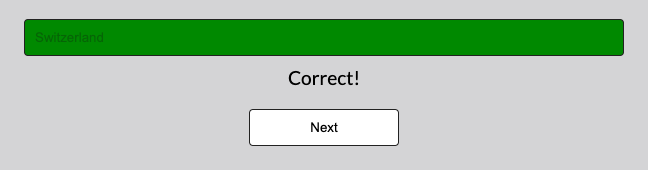
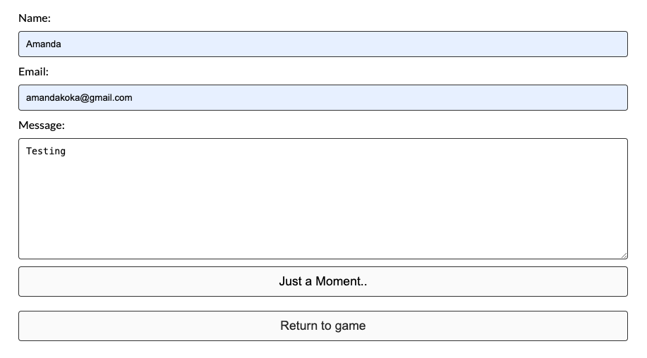
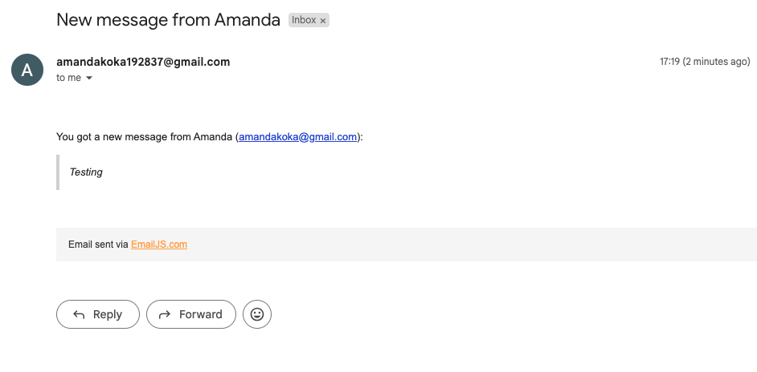
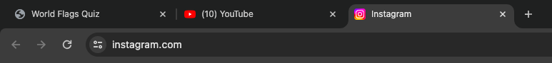

# Testing

1. [HTML Validation](#html-validation)
2. [CSS Validation](#css-validation)
3. [JavaScript Validation](#javascript-validation)
4. [Manual Testing](#manual-testing)
5. [Performance](#performance)
6. [Device Testing](#device-testing)
7. [Browser Testing](#browser-testing)
8. [Bugs While Testing Browser and Devices](#bugs-while-testing-browser-and-devices)
9. [Testing User Stories](#testing-user-stories)
10. [Bugs](#bugs)
11. [Known Bugs](#known-bugs)

## HTML Validation 
The W3C validator was used to validate the HTML on all pages.

#### First Validation Test:
- **Home Page:**
  - Initial Validation: [Before Fix](documentation/html-validation/initial-html.png)
  - Issue: Missing image source and alt text.
  - Fix: Added a source to the image and included alt text.

- **Contact Page:**
  - Initial Validation: [Before Fix](documentation/html-validation/contact-html-val.png)
    - Issue 1: Unnecessary style attribute in the emailjs tag.
    - Issue 2: The 'a' element cannot be a descendant of a 'button' element.
  - Fix: Removed the style attribute and changed the button to a div element.

#### Final Validation Test:
- **Home Page:**
  - [After Fix](documentation/html-validation/html.png)

- **Contact Page:**
  - [After Fix](documentation/html-validation/contact-val-html2.png)

## CSS Validation

The W3C Jigsaw CSS validator was used to validate the CSS of the website. Both tests passed with no errors.

- [Full Page](documentation/css-validation/cssvalwebsite.png) 
- [Style.css File](documentation/css-validation/cssvalfile.png)

## JavaScript Validation

Google Chrome developer tools were used throughout to test JavaScript.

#### Console Output:
1. Insert "console.log" statements at different points in my JavaScript code when something wasn't working or I was testing to see if there were any errors.
2. Opened my website in my browser and accessed developer tools by selecting inspect.
   - Checked the "console" tab for any logs or error messages outputted by my JavaScript code.
3. All console logs were shown, and no error messages were found.

## Manual Testing:

#### 1. Start the Quiz:
   - **Action:** Clicked the "Start Quiz" button.
   - **Expected Results:**
     - The quiz screen should be displayed.
     - The timer should start counting up.
   - **Verifications:**
     - Confirmed the display of the quiz screen.
     - Checked the accurate initiation of the timer.

#### 2. Answer Questions:
   - **Actions:**
     - Clicked on each answer for a question.
   - **Expected Results:**
     - The selected answer should be visually highlighted.
     - A correct/incorrect message should be displayed.
     - The correct and incorrect scores should be updated accordingly.
   - **Verifications:**
     - Checked the correct highlighting of the selected answer.
     - Verified the display of correct/incorrect messages.
     - Confirmed the accurate update of the correct and incorrect scores.

#### 3. Navigation:
   - **Actions:**
     - Clicked the "Next" button after answering each question.
   - **Expected Results:**
     - The next question should be displayed.
     - The progress bar should be accurately updated.
   - **Verifications:**
     - Ensured the display of the next question.
     - Validated the accurate update of the progress bar.

#### 4. Timer Functionality:
   - **Observations:**
     - Monitored the timer while answering questions.
   - **Expected Results:**
     - The timer should increment correctly.
     - The timer should stop when the quiz is completed.
   - **Verifications:**
     - Ensured correct and continuous timer incrementation.
     - Confirmed the timer stops when the quiz is completed.

#### 5. Restart Quiz:
   - **Action:** Clicked the "Play again!" button after completing the quiz.
   - **Expected Results:**
     - The quiz should reset.
     - The first question should be displayed and must be a different order.
     - Scores (correct and incorrect) should be reset.
   - **Verifications:**
     - Verified the successful reset of the quiz.
     - Confirmed the display of the first question and different order.
     - Checked and confirmed the reset of scores.

#### 6. Quiz Completion:
   - **Actions:**
     - Answered all questions and completed the quiz.
   - **Expected Results:**
     - The final score should be displayed.
     - The "Play again!" button should appear.
   - **Verifications:**
     - Validated the display of the final score.
     - Checked and confirmed the appearance of the "Play again!" button.

#### 7. Contact Form:
   - **Actions:**
     - Send an email.
   - **Expected Results:**
     - Site owner recieves the email.
     - Buttons text should change to "message successfuly sent" if email sent successfully.
   - **Verifications:**
     - Validated the display of the change in text of send button.
     - Checked and confirmed email sent successfully.

## Performance 
For the performance of the website, Lighthouse and Chrome Developer Tools were used to test the peformance of the website.
#### First Performance Test:
- **Home Page:**
  - Initial Performance: [Before Fix](documentation/performance/initial-hp-lighthouse.png)
  - Issue: Header image element too large.
  - Issue 2: Google Fonts link in html.
  - Fix: Converted my header png into a webp and compressed the image. Imported the google fonts url in my CSS.

- **Contact Page:**
  - Initial Performance: [Before Fix](documentation/performance/initial-cp-lighthouse.png)
    - Issue 1: Header image element too large.
    - Issue 2: Google Fonts link in html.
  - Fix: Converted my header png into a webp and compressed the image. Imported the google fonts url in my CSS.

#### Final Performance Test:
- **Home Page:**
  - [After Fix](documentation/html-validation/html.png)

- **Contact Page:**
  - [After Fix](documentation/html-validation/contact-val-html2.png)

## Device testing
The website was tested on the following devices: 

- MacBook air 13 inch
- Ipad 7th Gen
- Iphone 12
- Iphone 12 mini 

In addition, the website was tested using google chrome developer tools to ensure the responsiveness on different screen sizes by pressing all device options.

## Browser testing
The website was tested on the following browsers:

- Google Chrome
- Safari
- Firefox

## Bugs while testing browser and devices
| **Bug** | **Fix** |
| ----------- | ----------- |
|[Button Text Bug](documentation/bugs/button-text-bug.png) 
In mobile and tablet view the text in the quiz buttons and the next button were blue in all browsers I tested | Added a css style to the text in the buttons so they were black. |

## Testing user stories
1. As a user, I want to know what the right flag is in case I dont pick correctly.

| **Feature** | **Action** | **Expected Result** | **Actual Result** |
|-------------|------------|---------------------|-------------------|
| Quiz buttons | Attempt to answer a question | Display the correct flag name if the answer is incorrect | Works as expected. The correct flag lights up in green even if you pick the incorrect answer |

Screenshots

 

2. As a user, I want to see how many flags I have got correct and incorrect.

| **Feature** | **Action** | **Expected Result** | **Actual Result** |
|-------------|------------|---------------------|-------------------|
| Incorrect and correct scores | Answer quiz questions | Display real-time updates of correct and incorrect scores | Works as expected. Incorrect scores and correct scores are shown going through the quiz and at the end. |

Screenshots

 

3. As a user, I want to see how long I take guessing the flags.

| **Feature** | **Action** | **Expected Result** | **Actual Result** |
|-------------|------------|---------------------|-------------------|
| Timer | Answer quiz questions | Display the time taken to complete the quiz | Works as expected. Timer runs during the flag quiz and stops at the end so the user can see how long they took |

Screenshots

 

4. As a user, I want to receive feedback when I get an answer correct or incorrect.

| **Feature** | **Action** | **Expected Result** | **Actual Result** |
|-------------|------------|---------------------|-------------------|
| Message Container | Answer quiz questions | Display feedback messages based on correctness of the answers | Works as expected. When the use clicks their answer they either get a message or "correct!" or "incorrect". |

Screenshots

 

5.. As a site owner, I want users to be able to contact us and leave any feedback.

| **Feature** | **Action** | **Expected Result** | **Actual Result** |
|-------------|------------|---------------------|-------------------|
| Contact Form | Submit a message through the form | Receive an email notification or confirmation upon successful submission | Works as expected. Users can successfully send an email and the site-owner receives that email. |

Screenshots

 

6. As a site owner, I want users to find us on social media.

| **Feature** | **Action** | **Expected Result** | **Actual Result** |
|-------------|------------|---------------------|-------------------|
| Social Media Links | Click on social media icons | Redirect to respective social media profiles or pages | Works as expected. When social media links are clicked it takes you to the page. |

Screenshots

 

## Bugs 
| **Bug** | **Fix** |
| ----------- | ----------- |
| [Button bug](documentation/bugs/buttonbug.png) 
After starting a new game, the first four answer buttons were still visible. This occurred because the state was not properly reset after starting a new game.| Implemented a reset state function to ensure that the initial state is properly cleared, including the visibility of answer buttons. |
| [Image bug](documentation/bugs/imagebug.png)
 The question was displaying as text instead of an image. The HTML structure needed modification to ensure that the question is rendered as an image.  | Updated the HTML code to correctly include image elements, resolving the issue of text display and ensuring that questions are consistently presented as images. |
| Game scores and total score were still appearing when starting a new game. This occurred because the final score, correct, and incorrect elements were not being cleared after starting a new game. | Added a restart quiz function to reset the necessary elements, including the final score, correct, and incorrect elements, ensuring a clean start for each new game. |
| Content distorted in certain views. The content was distorted in certain views, affecting the visual layout. This distortion occurred due to the lack of responsive design elements, causing elements to display improperly on smaller screens or specific resolutions. | Implemented media queries in the CSS to apply specific styling adjustments based on screen size. This ensured that the content layout adapts appropriately to different devices, preventing distortion and maintaining a visually appealing presentation. |
| [Message Bug](documentation/bugs/messagebug.png) 
The message was still appearing when moving to the next question. The message container was not properly reset during the transition to the next question. | Included the "message container" in the reset state function to clear any existing messages, preventing them from carrying over to the next question. |
| [Progress Bar Bug](documentation/bugs/progressbarbug.png)
 The progress bar wasn't filling when the game finished. The progress bar was not updated to 100% when displaying the final score. | Modified the show score function to set the progress bar to 100% when showing the final score, ensuring that the progress bar accurately reflects completion. |
| [Timer Bug](documentation/bugs/timerbug.png) 
The timer was starting before the user pressed the "Start Quiz" button. The timer interval was not properly controlled, leading to premature initiation. | Added an event listener to start the timer only when the user clicks the "Start Quiz" button, preventing the timer from starting unintentionally. |
| [Timer Bug 2](documentation/bugs/timerbug2.png) 
The timer wasn't resetting to zero when the game restarted. The timer reset logic was not properly integrated into the restartQuiz function.| Integrated the timer reset logic within the restartQuiz function to ensure the reset of the timer. Specifically, the timerSeconds variable is explicitly set to zero when restarting the quiz, preventing any carryover of the previous timer value. |
| [Image Bug 2](documentation/bugs/img2bug.png) 
Image and alt text were showing on the score page. | Implemented a check within the "showScore" function to ensure that the image elements display is set to none. This prevents any lingering image or alt text from being displayed on the score page. |
| [Image Bug 3](documentation/bugs/img3bug.png) 
The images weren't appearing when the quiz was restarted and played again. | Updated the "resetState" function to explicitly set the display property of the image element display to block to ensure that the image is visible when the quiz is reset. This addresses the issue of images not appearing after restarting the quiz. |

## Known Bugs 
1. When the user completes the harder quiz questions and presses "Go Back to Start Screen", then starts the quiz again, the harder questions are displayed instead of the original questions. I am currently working on fixing this behavior to ensure that the original questions are displayed when starting the quiz after going back to the start screen.

### Workaround
Currently, the workaround for bug #1 is to refresh the page after pressing "Go Back to Start Screen" to reset the quiz state correctly.

### In Progress
I am actively working on a fix for bug #1 and will update the repository as soon as the issue is resolved.
